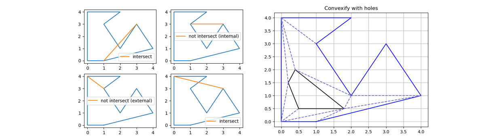

# RecastNav Lab1 - Meadow Mapping

  
[](https://github.com/liubai01/DiveRecastNav-Lab1-MeadowMapping/actions/workflows/pylint.yml)
[](https://github.com/liubai01/DiveRecastNav-Lab1-MeadowMapping/actions/workflows/Testcases.yml)
[](https://codecov.io/gh/liubai01/DiveRecastNav-Lab1-MeadowMapping)



[[Video Tutorial(Mandarin Chinese)](https://www.bilibili.com/video/BV19G4y187Fz/)]   [[Tutorial Main-page](https://cims.nyu.edu/~yx2412/nav/)]

An python implementation of *Path planning for a vision-based autonomous robot*, the Meadow Map. The earliest prototype of a NavMesh.

## Setup the environment

1. Python3
2. run `python.exe -m pip install -r .\requirement.txt` to install required packages

## Recast vs Lab1 Implementation

The implementation of this repo. could correspond exactly to [Recast Navigation](https://github.com/recastnavigation/recastnavigation)'s functions.

| Lab1                     | Recast                      | Link (Recast)                                                |
| ------------------------ | --------------------------- | ------------------------------------------------------------ |
| `basic_ops.py/left`      | `RecastMesh.cpp/left`       | [link](https://github.com/recastnavigation/recastnavigation/blob/0d1cbd3d6755712325f3c6278542174df5dd9cb8/Recast/Source/RecastMesh.cpp#L183) |
| `basic_ops.py/left_on`   | `RecastMesh.cpp/leftOn`     | [link](https://github.com/recastnavigation/recastnavigation/blob/0d1cbd3d6755712325f3c6278542174df5dd9cb8/Recast/Source/RecastMesh.cpp#L188) |
| `basic_ops.py/collinear` | `RecastMesh.cpp/collinear`  | [link](https://github.com/recastnavigation/recastnavigation/blob/0d1cbd3d6755712325f3c6278542174df5dd9cb8/Recast/Source/RecastMesh.cpp#L193) |
| `basic_ops.py/between`   | `RecastMesh.cpp/between`    | [link](https://github.com/recastnavigation/recastnavigation/blob/0d1cbd3d6755712325f3c6278542174df5dd9cb8/Recast/Source/RecastMesh.cpp#L213) |
| `diag.py/diagonalie`     | `RecastMesh.cpp/diagonalie` | [link](https://github.com/recastnavigation/recastnavigation/blob/master/Recast/Source/RecastMesh.cpp) |
| `diag.py/in_cone`        | `RecastMesh.cpp/inCone`     | [link](https://github.com/recastnavigation/recastnavigation/blob/0d1cbd3d6755712325f3c6278542174df5dd9cb8/Recast/Source/RecastMesh.cpp#L270) |
| `diag.py/intersect`      | `RecastMesh.cpp/intersect`  | [link](https://github.com/recastnavigation/recastnavigation/blob/0d1cbd3d6755712325f3c6278542174df5dd9cb8/Recast/Source/RecastMesh.cpp#L225) |

## Reference

```
@inproceedings{arkin1987path,
  title={Path planning for a vision-based autonomous robot},
  author={Arkin, Ronald C},
  booktitle={Mobile Robots I},
  volume={727},
  pages={240--250},
  year={1987},
  organization={SPIE}
}
```

